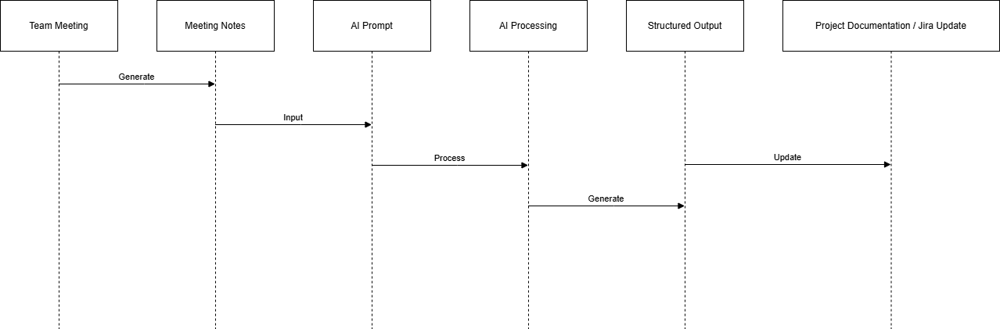

# AI-Assisted Agile Project Management Toolkit

A portfolio project demonstrating how Generative AI can support Agile Project Managers in improving productivity, documentation, and project delivery workflows.

---

## Project Overview

Project managers often spend significant time on repetitive operational tasks such as:

- writing meeting summaries
- organizing backlog items
- preparing stakeholder reports
- identifying project risks
- documenting sprint outcomes

Generative AI tools can help automate many of these activities and allow project managers to focus more on delivery management, team coordination, and decision making.

This project demonstrates practical examples of how AI can support Agile project management workflows.

---

## Scenario

The example workflows in this project are based on a **global ecommerce platform development environment**, where multiple teams collaborate to build and maintain an online marketplace for automotive parts.

Typical project activities include:

- sprint planning
- backlog refinement
- technical meetings
- stakeholder reporting
- risk identification

This toolkit explores how AI can assist with these activities.

---

## Key Use Cases

### 1️⃣ Meeting Summary Automation

Project managers often convert meeting discussions into structured meeting minutes.

AI can analyze meeting notes and generate summaries containing:

- key decisions
- action items
- responsible teams
- project risks

Example files for this workflow can be found in the `examples` folder.

---

### 2️⃣ AI-Assisted Sprint Planning

Sprint planning requires reviewing backlog items and organizing them into achievable sprint goals.

AI can assist by analyzing backlog items and suggesting:

- task priorities
- estimated effort
- potential dependencies

This provides a starting point for team discussions during sprint planning sessions.

---

### 3️⃣ Project Risk Analysis

AI can analyze project tasks and identify possible risks early in the development process.

Example outputs may include:

- risk descriptions
- potential impact
- probability assessment
- mitigation strategies

---

### 4️⃣ Stakeholder Reporting

Stakeholders often require simplified project updates that summarize technical progress.

AI can convert technical updates into structured reports including:

- current progress
- key achievements
- potential risks
- next steps

---

## Workflow

Typical workflow using AI tools in project management:

Team Meeting  
↓  
Meeting Notes  
↓  
AI Prompt Processing  
↓  
Structured Output (Summary / Report / Plan)  
↓  
Project Documentation or Jira Updates  

---

## Workflow Diagram

Below is a simplified architecture of how AI supports project management tasks.

---

## Repository Structure

## Repository Structure
